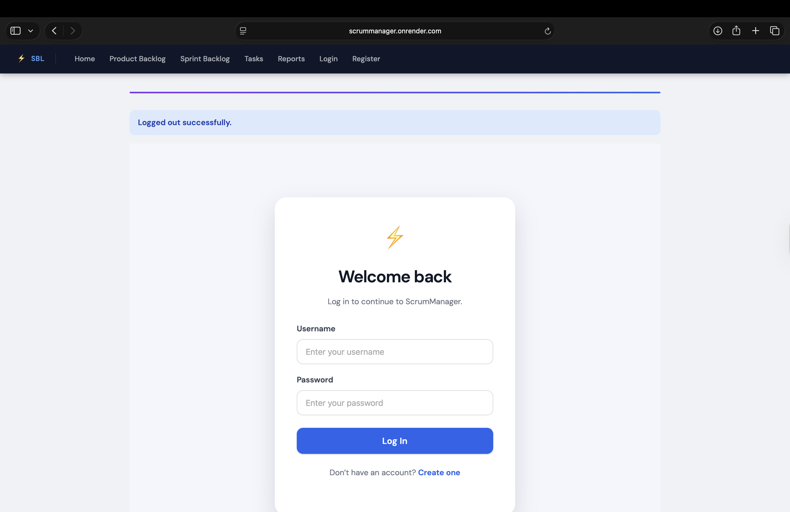
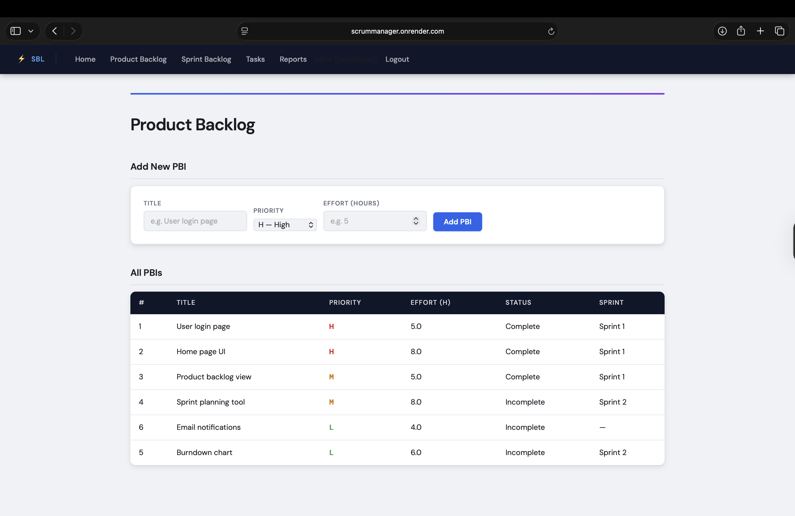
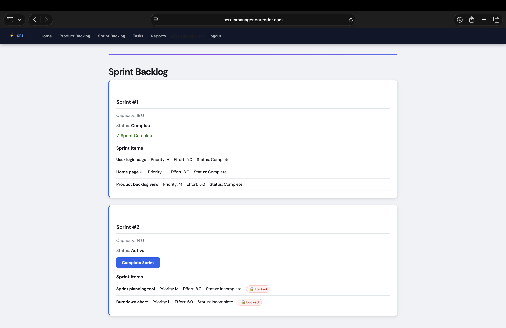

# ScrumManager

A full-stack Scrum management web application built with Python, Flask, and PostgreSQL. Supports full sprint lifecycle management with role-based access control, audit logging, automated testing, and CI/CD.

🔗 **Live Demo:** [https://scrummanager.onrender.com](https://scrummanager.onrender.com)  
> Demo credentials: username `alice` or `bob` (developer), `carol` (client) — password: `password123`

---

## Features

- **Role-based access control** — developers, clients, and scrum masters see different views
- **Product Backlog** — create and prioritize PBIs by effort and priority (H/M/L)
- **Sprint Planning** — auto-propose sprints based on capacity, lock items once active
- **Task Management** — decompose PBIs into tasks, track status (Not Started / In Progress / Done)
- **Burndown Charts** — visualize sprint progress with matplotlib
- **Audit Logging** — every PBI, sprint, and task change is recorded with user and timestamp
- **Project Model** — data organized by project for multi-team support

## Screenshots

**Login Page**


**Product Backlog**


**Sprint Backlog**

---

## Tech Stack

| Layer | Technology |
|---|---|
| Backend | Python 3.12, Flask, Flask-Login, Flask-Bcrypt |
| Database | PostgreSQL, SQLAlchemy, Flask-Migrate |
| Frontend | HTML, CSS, Jinja2 Templates |
| Testing | pytest, pytest-cov (66% coverage) |
| DevOps | Docker, GitHub Actions CI/CD, Render.com |

---

## Local Setup

**1. Clone the repository**
```bash
git clone https://github.com/ScrumManagerTeam/ScrumManager.git
cd ScrumManager
```

**2. Install dependencies**
```bash
pip install -r requirements.txt
```

**3. Create a `.env` file**
```
DATABASE_URL=postgresql://localhost/scrummanager_dev
SECRET_KEY=your-secret-key
FLASK_ENV=development
```

**4. Run database migrations**
```bash
python3 -m flask db upgrade
```

**5. (Optional) Seed demo data**
```bash
python3 seed.py
```

**6. Start the app**
```bash
python3 app.py
```

Open `http://127.0.0.1:5000`

---

## Running with Docker

```bash
docker-compose up --build
```

Then run migrations inside the container:
```bash
docker-compose run web python3 -m flask db upgrade
```

---

## Running Tests

```bash
python3 -m pytest tests/ -v --cov=. --cov-report=term-missing
```

Current coverage: **66%**

---

## Project Structure

```
ScrumManager/
├── app.py                  # App factory and configuration
├── models.py               # SQLAlchemy models
├── seed.py                 # Demo data seeder
├── Dockerfile
├── docker-compose.yml
├── routes/
│   ├── auth_routes.py
│   ├── atena_routes.py     # Backlog
│   ├── homa_routes.py      # Sprints
│   ├── hamed_routes.py     # Tasks and Reports
│   └── setayesh_routes.py
├── templates/              # Jinja2 HTML templates
├── static/                 # CSS and charts
├── tests/                  # pytest test suite
└── migrations/             # Alembic migrations
```
---
## Team

| Name | GitHub |
|---|---|
| Atena Hosseinifar | [@atenahfr](https://github.com/atenahfr) |
| Homa Ahmadinoori | [@homanoori](https://github.com/homanoori) |
| Hamed Tavanpour | [@hamedtavanapour-prog](https://github.com/hamedtavanapour-prog) |
| Setayesh Mahmoudi | [@setayesh-mahmoudi](https://github.com/setayesh-mahmoudi) |
| Sasan Shahin | — |